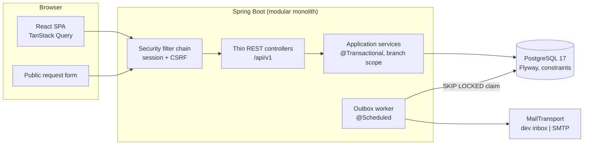

# Electrónica Rojas

Operations platform for a multi-branch electronics and appliance repair shop: per-branch inventory, in-shop
repairs and home-service visits in one Java/Spring Boot + React + PostgreSQL application.

> **Status: portfolio project.** Based on the operating context of a real two-branch electronics and appliance
> repair business known to the author, with the possibility of evolving into a pilot. All operational and demo
> data are fictitious. The application is not in production, and the documented business rules remain
> *proposed* until formally validated with the business owners ([project context](docs/00_Contexto_Proyecto.md)).

## The business problem

A shop with several branches does three jobs that share people, customers and stock: it **sells** products and
spare parts, **repairs** customers' appliances left at the counter, and **sends technicians** to customers'
homes. Without a shared system, stock lives in per-branch spreadsheets and transfers leave no trace, the same
customer is registered several times, nobody is sure which appliances are still in the workshop, and two visits
get promised to the same technician at the same time.

## The solution

One application where each collaborator sees only their branches and tasks, and where the rules that protect
stock, custody and the agenda are enforced **on the server and in PostgreSQL**, not in the UI:

- stock never goes negative, and a transfer or a spare part used in a repair is applied exactly once, even with
  double clicks, network retries or concurrent users;
- a customer's appliance is tracked through an explicit repair state machine and is delivered exactly once;
- a home-service request is never a booking until staff confirm a visit, and a technician can never be
  double-booked;
- customers are notified only with explicit per-channel consent, through a transactional outbox, so a mail
  failure never rolls back the business operation.

## Engineering highlights

1. **Transactional, idempotent inter-branch transfers.** Debit, credit, header, both movements and the audit
   event commit together; a client `operationId` plus a SHA-256 fingerprint makes retries return the original
   result. [`StockTransferService`](backend/src/main/java/dev/jeffrojas/electronicarojas/inventory/StockTransferService.java),
   [`OperationFingerprint`](backend/src/main/java/dev/jeffrojas/electronicarojas/shared/OperationFingerprint.java),
   [`StockTransferIntegrationTests`](backend/src/test/java/dev/jeffrojas/electronicarojas/inventory/StockTransferIntegrationTests.java).
2. **Pessimistic locking in a global order, proven with concurrent HTTP against real PostgreSQL.** One
   `StockLedger` upserts missing rows (`ON CONFLICT DO NOTHING`) and takes `SELECT … FOR UPDATE` in ascending
   branch order; tests fire 8 simultaneous sessions for last-unit sales, competing and opposite transfers.
   [`StockLedger`](backend/src/main/java/dev/jeffrojas/electronicarojas/inventory/StockLedger.java),
   [`InventoryConcurrencyIntegrationTests`](backend/src/test/java/dev/jeffrojas/electronicarojas/inventory/InventoryConcurrencyIntegrationTests.java),
   [`RepairPartConcurrencyIntegrationTests`](backend/src/test/java/dev/jeffrojas/electronicarojas/repairs/RepairPartConcurrencyIntegrationTests.java).
3. **Explicit repair state machine.** A pure policy class holds the transition table and per-role rules, is
   unit-tested exhaustively, and is the only code allowed to change an order's status; the API returns the
   allowed actions so the SPA never guesses.
   [`RepairPolicy`](backend/src/main/java/dev/jeffrojas/electronicarojas/repairs/RepairPolicy.java),
   [`RepairWorkflow`](backend/src/main/java/dev/jeffrojas/electronicarojas/repairs/RepairWorkflow.java),
   [`RepairPolicyTest`](backend/src/test/java/dev/jeffrojas/electronicarojas/repairs/RepairPolicyTest.java).
4. **Per-branch authorization and IDOR protection.** A single decision point re-reads the user's branches on
   every call; out-of-scope ids return the same 404 as missing ones, and every module has negative tests.
   [`BranchService`](backend/src/main/java/dev/jeffrojas/electronicarojas/branches/BranchService.java),
   [`BranchAccessIntegrationTests`](backend/src/test/java/dev/jeffrojas/electronicarojas/branches/BranchAccessIntegrationTests.java).
5. **No double-booking, in two layers.** A transaction-scoped advisory lock per technician serializes
   confirmations, and a PostgreSQL `EXCLUDE USING gist` constraint on `tstzrange` refuses overlaps even if the
   code were wrong. [`VisitService`](backend/src/main/java/dev/jeffrojas/electronicarojas/servicerequests/VisitService.java),
   [`V9__home_service.sql`](backend/src/main/resources/db/migration/V9__home_service.sql),
   [`VisitConcurrencyIntegrationTests`](backend/src/test/java/dev/jeffrojas/electronicarojas/servicerequests/VisitConcurrencyIntegrationTests.java).
6. **Transactional outbox.** Notices are written in the business transaction (`Propagation.MANDATORY`); a worker
   claims them with `FOR UPDATE SKIP LOCKED` and a lease, re-checks consent, sends outside any transaction and
   records a fenced result. [`NotificationOutbox`](backend/src/main/java/dev/jeffrojas/electronicarojas/notifications/NotificationOutbox.java),
   [`OutboxStore`](backend/src/main/java/dev/jeffrojas/electronicarojas/notifications/OutboxStore.java),
   [`NotificationOutboxIntegrationTests`](backend/src/test/java/dev/jeffrojas/electronicarojas/notifications/NotificationOutboxIntegrationTests.java).
7. **PostgreSQL as the second line of defense.** CHECK, UNIQUE, partial unique indexes and append-only triggers
   guard stock, history, quotes and custody; Flyway migrations are immutable and CI fails if one changes.
   [`V3__inventory.sql`](backend/src/main/resources/db/migration/V3__inventory.sql),
   [`InventorySchemaIntegrationTests`](backend/src/test/java/dev/jeffrojas/electronicarojas/inventory/InventorySchemaIntegrationTests.java),
   [`check-migrations.sh`](scripts/check-migrations.sh).
8. **Accessible, responsive React UI.** Own design system on CSS custom properties, three palettes checked for
   WCAG 2.2 AA in CI, tables that become cards on phones, a focus-trapped drawer and an ARIA combobox with
   cancellation of stale requests. [`design-system.md`](docs/design-system.md),
   [`check-contrast.mjs`](frontend/scripts/check-contrast.mjs),
   [`CustomerPicker.test.tsx`](frontend/src/features/customers/CustomerPicker.test.tsx).

Every critical rule is traced from business rule to class, database constraint and test in
[`05_Trazabilidad_Requisitos.md`](docs/05_Trazabilidad_Requisitos.md).

## Architecture

A **modular monolith** ([ADR-001](docs/04_Arquitectura_ADR.md)): one Spring Boot application with business
modules (`branches`, `users`, `inventory`, `customers`, `repairs`, `servicerequests`, `notifications`,
`dashboard`, `audit`) that talk through public services without cycles, one PostgreSQL database owned by Flyway,
and a React SPA served from the same origin (Vite proxies `/api` in development, so there is no CORS). Controllers
are thin; transactions and branch authorization live in application services; state machines and scheduling
arithmetic are pure classes tested without Spring.



Details, data model and all decisions with trade-offs: [`04_Arquitectura_ADR.md`](docs/04_Arquitectura_ADR.md).

## Tech stack

| Layer | Technology |
|---|---|
| Backend | Java 25, Spring Boot 4.1.1 (Spring MVC, Security, Data JPA, Validation, Actuator, Mail), Maven Wrapper |
| Database | PostgreSQL 17, Flyway (`ddl-auto=validate`), `pg_trgm`, `btree_gist` |
| Backend tests | JUnit 5, Mockito, MockMvc, Spring Security Test, Testcontainers (PostgreSQL 17) |
| Frontend | React 19, TypeScript, Vite, React Router, TanStack Query; route-level code splitting |
| Frontend tests | Vitest, Testing Library, oxlint, WCAG contrast check |
| UI | Own design system on CSS custom properties, own SVG icons, no UI framework |
| Tooling | Docker Compose, GitHub Actions, VS Code tasks |

## Testing and CI

- **Backend:** unit tests for pure policies, MockMvc tests for HTTP and security, and integration tests
  (`@Tag("integration")`) that start a disposable `postgres:17` with Testcontainers, apply every migration and
  cover CSRF, IDOR, database constraints, rollbacks and real concurrency over HTTP.
- **Frontend:** Vitest + Testing Library for i18n, domain helpers, keyboard behavior of menus and pickers,
  receipt privacy and palette persistence; type check, lint, bundle build and contrast of every palette.
- **CI** ([`ci.yml`](.github/workflows/ci.yml)): `./mvnw -B verify` on Java 25, `npm ci` + lint + test + contrast +
  build on Node 24, a check that applied migrations never change, and a check that no `.env` file is tracked.

## Quick start (Windows / PowerShell)

Prerequisites: JDK 25, Docker Desktop with the Engine running (`docker info`), Node.js 22.22+ (tested with 24).
Maven is not required (Maven Wrapper).

```powershell
# 1. Local secrets (git-ignored): set POSTGRES_PASSWORD and a 12+ character BOOTSTRAP_ADMIN_PASSWORD
Copy-Item .env.example .env
notepad .env

# 2. Database: PostgreSQL 17 on 127.0.0.1:5433
docker compose up -d --wait db

# 3. Backend on :8080 (derives DB_URL/DB_USERNAME/DB_PASSWORD from .env without printing them)
powershell -ExecutionPolicy Bypass -File .\scripts\start-backend.ps1

# 4. Frontend on http://localhost:5173 (new terminal)
cd frontend; npm ci; npm run dev
```

Log in with the bootstrap administrator, create branches in *Sucursales* and collaborators in *Usuarios*. The
public home-service form is at `/solicitar/servicio-a-domicilio`. E-mails go to an in-memory development inbox
(*Más → Notificaciones*); nothing reaches real people. In VS Code, **Run Build Task** starts database, backend
and frontend. Optionally, `start-backend.ps1 -DemoSeed` loads a fictitious multi-week scenario through the real use
cases, on a local database only ([prerequisites](docs/runbook.md#datos-demo-para-el-portafolio)).

```powershell
cd backend; .\mvnw.cmd test                                # all tests (Docker Engine required)
cd backend; .\mvnw.cmd test "-DexcludedGroups=integration" # without Docker
cd frontend; npm run lint; npm test; npm run check:contrast; npm run build
```

Troubleshooting: [`docs/runbook.md`](docs/runbook.md).

## Documentation

The project documentation is in Spanish ([index](docs/README.md)):

| Document | Content |
|---|---|
| [00 Project context](docs/00_Contexto_Proyecto.md) | Problem, scenario vs. assumptions, scope, what is *not* claimed |
| [01 Engineering standards](docs/01_Estandares_Ingenieria.md) | Design, security, integrity, testing and CI rules (ER-ENG-001) |
| [02 Business rules](docs/02_Reglas_Negocio.md) | Invariants with *proposed/validated* and *implemented* status (ER-BR-001) |
| [03 Functional specification](docs/03_Especificacion_Funcional.md) | Module status, permissions, HTTP contract, acceptance criteria (ER-FS-001) |
| [04 Architecture and ADRs](docs/04_Arquitectura_ADR.md) | Structure, schema, 21 ADRs with alternatives and consequences (ER-ARCH-001) |
| [05 Traceability](docs/05_Trazabilidad_Requisitos.md) | Critical rule → requirement → code → constraint → test |
| [Design system](docs/design-system.md) | Tokens, palettes, components, responsive and accessibility (ER-DS-001) |

**Development approach:** requirements and invariants are documented before implementation, architectural
decisions are recorded as ADRs, and critical rules are traced to code, database constraints and automated tests.
AI-assisted engineering tools were used where useful, under the same review, testing and documentation standards
as any other change ([engineering standards](docs/01_Estandares_Ingenieria.md), [`CLAUDE.md`](CLAUDE.md)); final
decisions and validation remain with the project owner.

## Implemented vs. pending

| Area | Implemented | Pending |
|---|---|---|
| Access | Sessions, SPA CSRF, roles, per-branch scope, session revocation, login throttling | SSO, password self-service |
| Inventory | Catalog with cost and sale price, stock per branch, movements, idempotent transfers, consolidated view | Transfers in transit, purchasing, CSV export |
| Customers | Incremental search, identity resolution, per-channel consent | Consent re-confirmation when the e-mail changes (open decision) |
| Workshop | Reception, state machine, quotes, single delivery, spare parts with price snapshot, printable receipt | Photos, public order tracking |
| Home service | Configurable public portal with QR, inbox, visits, agenda, working hours, technician flow, link to workshop | Travel-time estimation, maps, customer-side rescheduling |
| Notifications | Transactional outbox, retries, templates, development inbox, admin view | Authorized SMTP provider, SPF/DKIM, WhatsApp |
| Dashboard | Indicators per branch or consolidated, priorities, upcoming visits, quick actions | Trends and reports |
| Pilot readiness | Fictitious data, secrets outside Git | Business validation of rules, TLS, backups with tested restore, privacy review |
| Commercial | — | Sales, Costa Rica e-invoicing, payments |

## Usage

Portfolio project published for review. No open-source license has been chosen yet.
